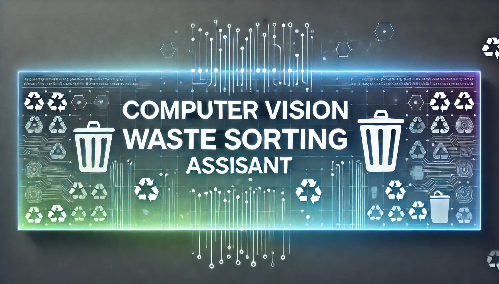
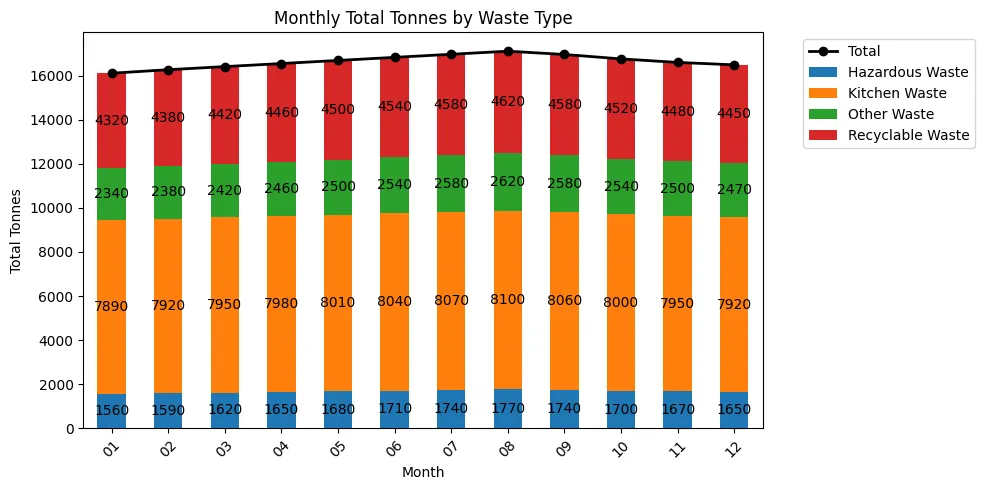
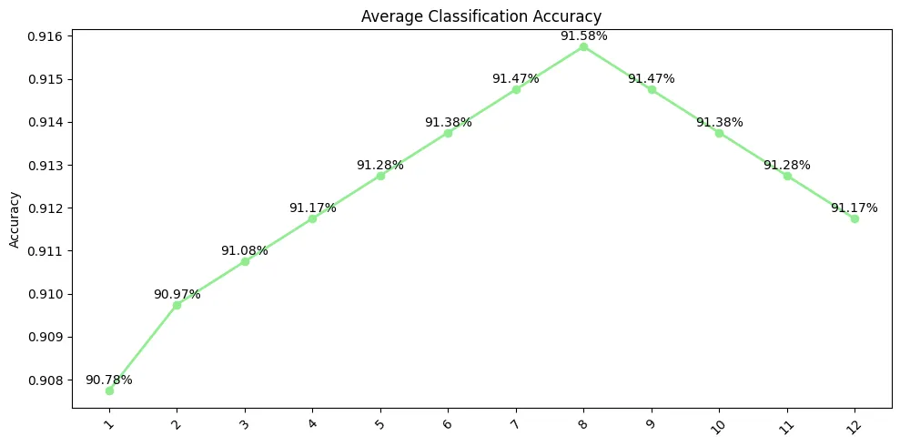

# Computer Vision Waste Sorting Assistant

<div align="center">



[](https://choosealicense.com/licenses/mit/)
[](https://www.python.org/downloads/)
[](https://pytorch.org/)

</div>

## 📚 About The Project

The Computer Vision-Enhanced Waste Sorting Assistant is a machine learning-powered system designed to enhance waste classification accuracy and improve recycling habits through real-time waste detection and data visualization. By utilizing YOLOv11 and a user-friendly interface, the project combines state-of-the-art object detection with actionable data insights to empower users and municipalities in their waste management efforts.

## 👥 Team

- Xinyi Wang - [GitHub Profile](https://github.com/thisissophiawang)
- Yijie Cao - [GitHub Profile](https://github.com/96philly)
- Min Ren 


## 🎯 Project Structure

```
CS5330FINAL/
├── .idea/                    # IDE configuration files
├── csv/                      # Waste management data (CSV files for dashboard analysis)
├── flagged/                  # Placeholder for flagged items (optional usage)
├── runs/                     # YOLOv11 training results and logs
├── ultralytics/              # YOLOv11 implementation and configurations
├── venv/                     # Virtual environment for project dependencies
├── .gitattributes            # Git LFS tracking information for large files
├── bar_chart.png             # Sample visualization of waste trends
├── best.pt                   # YOLOv11 model weights (best performance)
├── Data analysis.py          # Dashboard implementation code
├── end.py                    # Post-processing script for YOLO detections
├── Image_stitching.py        # Script for creating multi-object collages for training
├── Interface system.py       # Gradio-based interface for waste detection
├── mytrain.py                # Custom YOLOv5 training script
├── output_collage.jpg        # Sample collage image for training
├── output_collage2.jpg       # Sample collage image for training
├── output_collage3.jpg       # Sample collage image for training
├── output_collage4.jpg       # Sample collage image for training
├── output_collage5.jpg       # Sample collage image for training
├── predict.py                # Script for inference on test images
├── README.md                 # Project overview
├── requirements.txt          # List of dependencies for the project
├── results.csv               # Training results and metrics
├── rubbish.yml               # YOLOv11 dataset configuration file
├── test.py                   # Script for evaluating model performance
├── test.txt                  # Placeholder for testing data
├── txt_csv.py                # Script for converting YOLO text annotations to CSV format
├── visualization.png         # Dashboard visualization example
├── yolo11m.pt                # YOLOv11 model weights (latest)

```

## 📊 Documentation

This project includes comprehensive documentation to help users understand, implement, and utilize the **Computer Vision-Enhanced Waste Sorting Assistant**.

### Key Sections:

1. **System Overview**  
   Detailed explanation of the waste sorting assistant, its architecture, and its functionalities.  
   [Read the system overview here](https://docs.google.com/document/d/1KQ-AyhIjat8EFS0iiTZXc0ll5gX1VhSK/edit?usp=sharing&ouid=101491086530838580353&rtpof=true&sd=true).

2. **Dataset Preparation**  
   Step-by-step instructions on how the dataset was prepared, including preprocessing and augmentation techniques.  
   [Dataset Preparation Documentation](https://docs.google.com/document/d/1KQ-AyhIjat8EFS0iiTZXc0ll5gX1VhSK/edit?usp=sharing&ouid=101491086530838580353&rtpof=true&sd=true)).

3. **Model Training and Configuration**  
   Details on the YOLOv5-based model, including architecture, parameters, training workflow, and hyperparameter tuning.  
   [Model Training Guide](https://docs.google.com/document/d/1KQ-AyhIjat8EFS0iiTZXc0ll5gX1VhSK/edit?usp=sharing&ouid=101491086530838580353&rtpof=true&sd=true)).

4. **Dashboard Integration**  
   Documentation for the Gradio-based dashboard, including its features, configuration, and deployment process.  
   [Dashboard Guide](https://docs.google.com/document/d/1KQ-AyhIjat8EFS0iiTZXc0ll5gX1VhSK/edit?usp=sharing&ouid=101491086530838580353&rtpof=true&sd=true)).

5. **Results and Analysis**  
   Insights and analysis of model performance, evaluation metrics, and waste trends from the dashboard.  
   [Results Analysis](https://docs.google.com/document/d/1KQ-AyhIjat8EFS0iiTZXc0ll5gX1VhSK/edit?usp=sharing&ouid=101491086530838580353&rtpof=true&sd=true).


## 💡 Key Features

- **Real-Time Waste Detection**
  - Identifies multiple waste categories in a single image: recyclable, hazardous, kitchen, and other waste.
  - Provides bounding box visualizations and tailored recycling recommendations.
  - Powered by YOLOv11, offering high-speed and reliable object detection.

- **Interactive Data Analysis Dashboard**
  - Upload CSV files for waste data analysis.
  - Generate stacked bar charts, line graphs, and pie charts.
  - Explore trends such as monthly tonnage, classification accuracy, and recycling rates.

- **User-Friendly Interfaces**
  - Built using Gradio for accessibility and interactivity.
  - Huggingface Link: https://huggingface.co/spaces/96philly/5330final
  - Supports exporting of visualizations and reports for further analysis.

### 🛠️ How It Works

This section provides a high-level explanation of how the **Computer Vision-Enhanced Waste Sorting Assistant** operates:

1. **Dataset Preparation**  
   - A dataset of **2,744 waste images** was collected and categorized into four classes:  
     **Recyclable, Hazardous, Kitchen, and Other waste.**  
   - Images were annotated in **YOLO-compatible format**, and augmentations like horizontal flipping and mosaic augmentation were applied to improve the model's robustness.

2. **Model Training**  
   - The **YOLOv5** model was fine-tuned for waste detection using the prepared dataset.  
   - **Key parameters**:  
     - **Learning rate**: `0.01`  
     - **Batch size**: `32`  
     - **Epochs**: `400`  
   - Loss functions included **localization, classification, and objectness loss**.  
   - Metrics such as **mAP@50** were used for evaluation.

3. **Gradio Dashboard**  
   - A **Gradio-based interactive dashboard** allows users to:  
     - **Upload CSV files** for waste trend analysis.  
     - Visualize monthly tonnage, classification accuracy, and recycling rates using **line charts, bar charts, and pie charts**.  

4. **Real-Time Waste Classification**  
   - The model predicts bounding boxes for waste objects in uploaded images.  
   - Results include waste categories, locations, and recycling suggestions, enabling users to make data-driven decisions.

---

### 📊 Model Performance

The model demonstrated high detection accuracy and efficiency across various scenarios:

1. **Performance Metrics**  
   - **Mean Average Precision (mAP@50)**: `83.49%`  
   - **mAP@50-95**: `74.97%`  
   - **Precision**: `83.49%`  
   - **Recall**: `82.28%`  
   - Losses:  
     - **Box Loss**: `0.66185`  
     - **Classification Loss**: `0.39625`  

2. **Detection Speed**  
   - The model completed **400 epochs** in approximately **3 hours**, achieving near real-time predictions.

3. **Evaluation Insights**  
   - **Confusion Matrix Analysis**: Showed strong classification for "Recyclable" and "Kitchen Waste" categories but identified opportunities for improvement in "Other" and "Hazardous Waste" detection.  
   - **Loss Convergence**: Training and validation loss curves indicate stable convergence across all loss components (see `results.png`).  

4. **Visualization**  
   - The **Gradio dashboard** offers detailed performance tracking and interactive waste analysis tools.  
    - Example charts include classification accuracy trends, recycling rates, and monthly waste tonnage distribution.

   

   .webp)

   


    

## 📝 Course Information

This final project was developed as part of the Computer Vision course at Northeastern University.

## 🔎 References
1. **YOLOv5 Documentation**  
   Official YOLOv5 documentation and resources.  
   [Read more here](https://github.com/ultralytics/yolov5).

2. **Microsoft Research Asia**  
   For insights into advanced computer vision models and research on transformers.  
   [Visit here](https://www.microsoft.com/en-us/research/lab/microsoft-research-asia/).

3. **Gradio Documentation**  
   For building interactive machine learning interfaces.  
   [Learn more](https://gradio.app/).

4. **Metro Vancouver Waste Management Summary 2021**  
   Source of municipal waste management data for analysis and dashboard integration.  
   [Access the report here](https://metrovancouver.org/services/solid-waste/Documents/solid-waste-management-annual-summary-2021.pdf).

5. **PyTorch Framework**  
   Deep learning framework used for implementing YOLOv5 and custom scripts.  
   [Explore PyTorch](https://pytorch.org/).

6. **RoboFlow Dataset**  
   Trash detection dataset referenced for categorization and augmentation techniques.  
   [Visit RoboFlow](https://public.roboflow.com/object-detection).

   

## 📖 Citation

If you find this project helpful, please consider citing:

```bibtex
@project{waste_sorting_assistant2024,
    title={Computer Vision-Enhanced Waste Sorting Assistant},
    author={Xinyi Wang},
    institution={Northeastern University},
    year={2024},
    note={Deep Learning Course Project}
}
```

For academic use, please ensure to cite both the original work and our educational materials appropriately.
}
```


## 🤝 Contributing

Contributions are welcome! Please feel free to submit a Pull Request.

1. Fork the Project
2. Create your Feature Branch (`git checkout -b feature/AmazingFeature`)
3. Commit your Changes (`git commit -m 'Add some AmazingFeature'`)
4. Push to the Branch (`git push origin feature/AmazingFeature`)
5. Open a Pull Request

## 📧 Contact

For questions and feedback, please open an issue in this repository or contact team members directly.

## 🙏 Acknowledgments

- Ultralytics for the YOLOv11 framework.
-Gradio for the user interface library.
-Northeastern University for course guidance and support.

---

Made with ❤️ by Our Team
</div>
